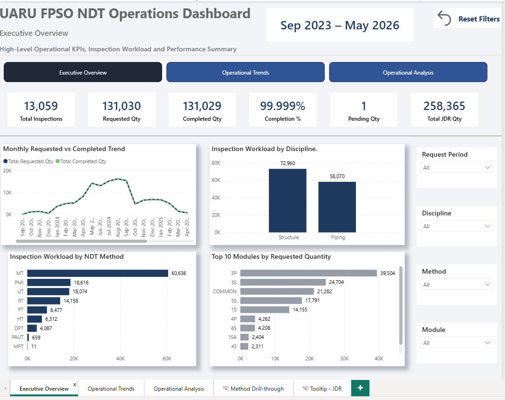
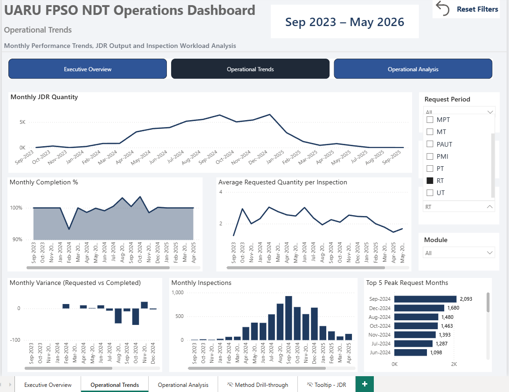
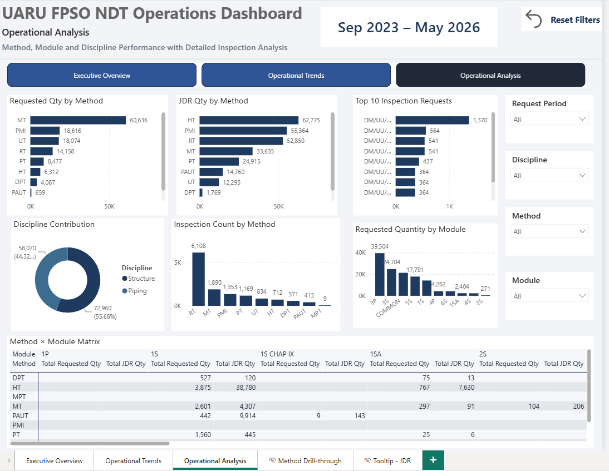
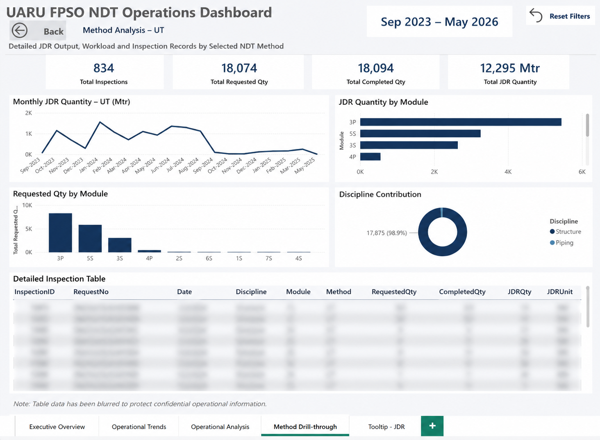
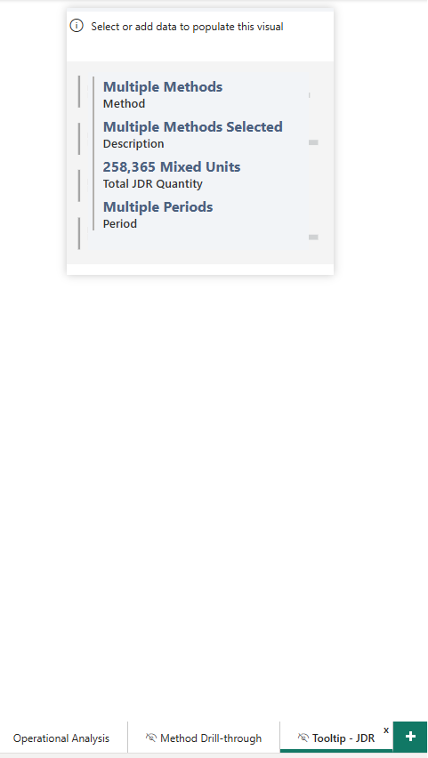
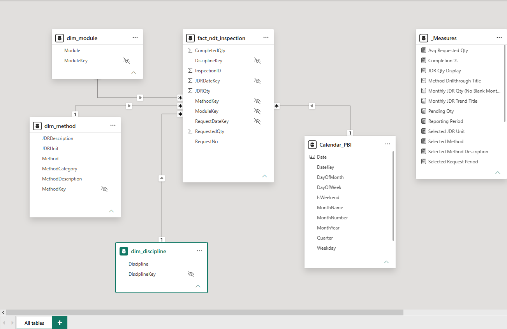

# UARU FPSO NDT Operations Analytics

End-to-end Business Intelligence project demonstrating Python ETL, SQL Server Data Warehouse development, analytical SQL, and interactive Power BI dashboards for operational inspection analytics.

> **Note**
>
> The original operational datasets are confidential and are **not included** in this repository. Dashboard screenshots have been reviewed to remove or obscure sensitive operational information.

---

# Project Overview

This project demonstrates a complete Business Intelligence solution for analysing Non-Destructive Testing (NDT) inspection operations in an FPSO environment.

The solution combines Python for ETL, SQL Server for data warehousing, and Power BI for interactive operational reporting.

---

# Business Problem

Inspection data was maintained across multiple Excel workbooks with inconsistent structures and varying data quality.

The objectives of this project were to:

- Consolidate multiple operational datasets
- Clean and validate inspection data
- Build a dimensional SQL Server data warehouse
- Develop analytical SQL queries
- Create an interactive Power BI dashboard for operational reporting

---

# Technology Stack

| Technology | Purpose |
|------------|---------|
| Python (Pandas) | Data Cleaning & ETL |
| SQL Server | Data Warehouse |
| SQL | Data Validation & Analytics |
| Power BI | Dashboard Development |
| DAX | KPI Calculations |
| GitHub | Project Documentation |

---

# Project Workflow

```text
Excel Files
     │
     ▼
Python ETL
     │
     ▼
Clean Staging Table
     │
     ▼
SQL Server Data Warehouse
     │
     ▼
Analytical SQL Queries
     │
     ▼
Power BI Dashboard
```

---

# Data Warehouse Design

The solution follows a **Star Schema** design.

### Fact Table

- fact_ndt_inspection

### Dimension Tables

- dim_calendar
- dim_method
- dim_module
- dim_discipline

---

# Dashboard Features

The Power BI dashboard includes:

- Executive Overview
- Operational Trends
- Operational Analysis
- Method Drill-through
- Dynamic Tooltip
- Interactive Slicers
- Dynamic Reporting Period
- Dynamic JDR Unit Display
- Bookmark-based Reset Filters

---

# Dashboard Screenshots

## Executive Overview



---

## Operational Trends



---

## Operational Analysis



---

## Method Drill-through



---

## Custom Tooltip



---

## Data Model



---

# Repository Structure

```text
UARU-FPSO-NDT-Operations-Analytics
│
├── 01_Data
├── 02_Python_ETL
├── 03_SQL
├── 04_Power_BI
├── 05_Images
└── README.md
```

---

# Key Business Insights

The dashboard enables users to:

- Monitor inspection workload
- Track requested vs completed quantities
- Analyse discipline performance
- Analyse inspection methods
- Compare module workload
- Monitor JDR output
- Analyse monthly operational trends
- Drill down into inspection methods

---

# Skills Demonstrated

- Python ETL
- Data Cleaning
- Data Validation
- SQL Server Data Warehouse Design
- Star Schema Modelling
- SQL Development
- Power BI Dashboard Design
- DAX Measures
- Business Intelligence Reporting
- GitHub Documentation

---

# Confidentiality

The original operational datasets belong to the respective organisation and are confidential.

This repository has been prepared as a technical portfolio project by:

- Excluding all source datasets
- Removing or obscuring confidential operational information from dashboard screenshots
- Publishing only the ETL process, SQL scripts, dashboard design, and project documentation
